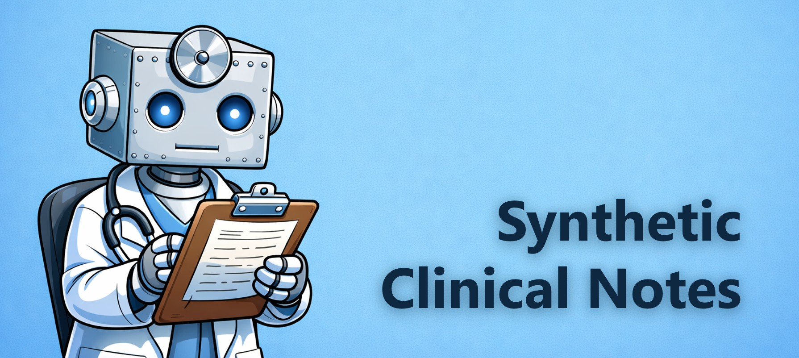

# Synthetic Clinical Note Generation

## NHS England Data Science and Applied AI Team



This project uses LLMs to generate synthetic clinical notes for entire patient journeys in hospitals.

### ⚠️ Important Notice to Users ⚠️

All data found in this repository is entirely **synthetic**.

Synthetic data is artificially generated data that mimics real-world data. It is typically created using real data as a seed and adding noise. However, in this pipeline **no real data is used** at any point. Synthetic data can help with analysis, testing, or model training without using real data.

Synthetic data does have limitations. For more information please read `docs/synthetic_data_limitations`.

### What does this project do?

This pipeline was developed to aid the testing and evaluation of AI generated discharge summaries.

Using any OpenAI-compatible LLM (locally via Ollama or vLLM, or via the OpenAI API), this pipeline generates **high quality** and **realistic** patient journeys and clinical notes.

Clinicians were heavily involved in the evaluation of clinical notes from this pipeline. Their thorough feedback was used to iteratively improve the pipeline.

**The pipeline:**

- Generates synthetic patients.
- Generates realistic admission reasons (emergency or elective) for each patient.
- Generates a realistic patient journey from the point of admission to just before discharge.
- Generates realistic clinical notes for each stage of the journey.
- Adds augmentations to each note (typos and medical abbreviations)

The pipeline is highly configurable using `config/params.py` and `config/config.py`.

The pipeline was tested with Python 3.12.12.

### Getting Started

1. **Install dependencies:**
   ```bash
   pip install -r requirements.txt
   ```

2. **Start a local model server.** The pipeline uses any OpenAI-compatible endpoint. Examples:
   - [Ollama](https://ollama.com): `ollama run qwen2.5:72b`
   - [vLLM](https://docs.vllm.ai): `vllm serve Qwen/Qwen2.5-72B-Instruct-AWQ`
   - OpenAI API: set `LLM_BASE_URL = "https://api.openai.com/v1"` and `LLM_API_KEY` to your key

3. **Configure the endpoint and model** in `config/config.py`:
   ```python
   LLM_BASE_URL = "http://localhost:11434/v1"  # Ollama default
   LLM_API_KEY = "not-needed"
   ```
   And set the model name in `config/params.py`:
   ```python
   "model": "qwen2.5:72b"  # must match what your server is serving
   ```

4. **Place input data** in `./data/` as CSV files. Example files are already provided. Dataset names in `config/params.py` must match the CSV filenames (without `.csv`).

5. **Review optional settings** in `config/config.py` and `config/params.py`. See `docs/adapting_the_pipeline` for details.

6. **Run the pipeline:**

   **Script (recommended for unattended/production runs):**
   ```bash
   python run_pipeline.py --generations 10 --run-name my_run
   ```
   Logs are written to stdout and to `logs/run_<timestamp>.log`. Exits with code 1 on failure.

   ```
   python run_pipeline.py --help   # see all options
   ```

   **Notebook (interactive/exploratory):** open `notebooks/run_pipeline.ipynb` and run cells sequentially.

   Outputs are written to `./output/`.

### Dependencies

The pipeline makes LLM calls via any OpenAI-compatible API. By default it is configured for a local [Ollama](https://ollama.com) server, but can be pointed at vLLM, the OpenAI API, or any other compatible endpoint by changing `LLM_BASE_URL` and `LLM_API_KEY` in `config/config.py`.

### Contributing

Contributions are what make the open source community such an amazing place to learn, inspire, and create. Any contributions you make are **greatly appreciated**.

1. Fork the Project
2. Create your Feature Branch (`git checkout -b feature/AmazingFeature`)
3. Commit your Changes (`git commit -m 'Add some AmazingFeature'`)
4. Push to the Branch (`git push origin feature/AmazingFeature`)
5. Open a Pull Request

_See [CONTRIBUTING.md](./CONTRIBUTING.md) for detailed guidance._

## License

Unless stated otherwise, the codebase is released under [the MIT License][mit].
This covers both the codebase and any sample code in the documentation.

_See [LICENSE](./LICENSE) for more information._

The documentation is [© Crown copyright][copyright] and available under the terms
of the [Open Government 3.0][ogl] licence.

[mit]: LICENCE
[copyright]: http://www.nationalarchives.gov.uk/information-management/re-using-public-sector-information/uk-government-licensing-framework/crown-copyright/
[ogl]: http://www.nationalarchives.gov.uk/doc/open-government-licence/version/3/

### Contributors (Alphabetical)

- Alice Waterhouse
- Amaia Imaz Blanco
- Ben Wallace
- Jonny Pearson
- Michael Spence
- Mobolu Olowoyeye
- Scarlett Kynoch
- Will Poulett

If you have questions, please [contact us](mailto:england.datascience@nhs.net).
